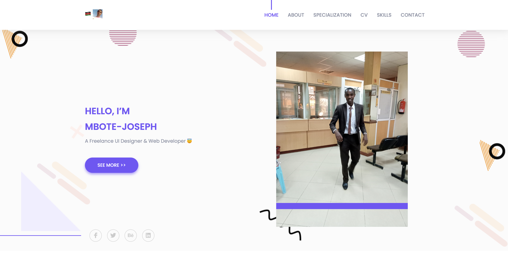

<h3>Hi, </h3>

## I am Mbote-Joseph, Software Engineer.

- 🌱 I’m currently learning and in my final year BSc. Computer Science at JKUAT.

- 📫 How to reach me:
  -Email: mbotejoseph001@gmail.com
  Mobile: +254792622515

## Languages:

- Python
- JavaScript
- Java
- HTML
- CSS
- PHP

## Frameworks

- Angular
- Django
  

## Libraries

- React JS

- ⚡ Fun fact: Not today, Not tomorrow but One day

### [🌲,🌳,🌴].push(🌲)

<!--
**Mbote-Joseph/Mbote-Joseph** is a ✨ _special_ ✨ repository because its `README.md` (this file) appears on your GitHub profile.

Here are some ideas to get you started:

- 🔭 I’m currently working on ...
- 🌱 I’m currently learning ...
- 👯 I’m looking to collaborate on ...
- 🤔 I’m looking for help with ...
- 💬 Ask me about ...
- 📫 How to reach me: ...
- 😄 Pronouns: ...
- ⚡ Fun fact: ...
-->

[](https://mbote-joseph.netlify.app/)

### Views

